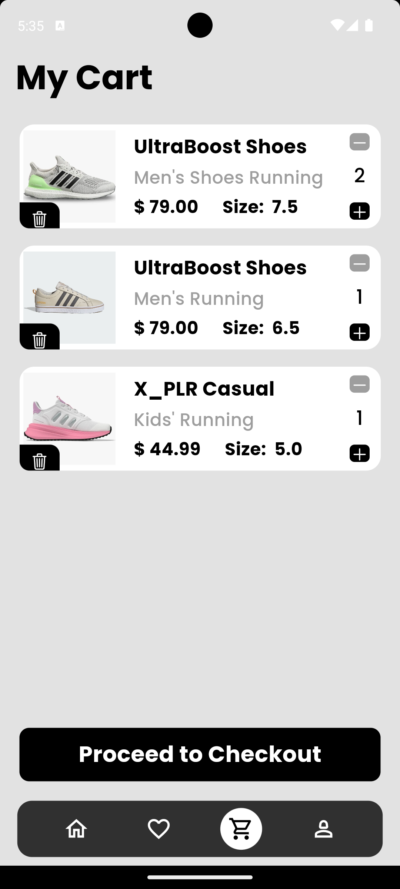

# ShoeMart

ShoeMart is an e-commerce application for shoes, built using Flutter. The app allows users to browse and purchase sneakers from three main categories: men's, women's, and kids' sneakers. It uses Firebase for authentication, Hive for local storage, and the Provider package for state management.

## Features

- **Login Screen**: Users can log in to the app using their email and password. Firebase authentication is used for secure login.
- **Home Screen**: Displays the latest sneakers divided into three sections: men's sneakers, women's sneakers, and kids' sneakers.
- **Favorites Screen**: Contains all the sneakers that the user has added to their favorites.
- **Cart Screen**: Shows all the sneakers that the user has added to their cart.
- **Profile Screen**: Provides user accessibility functions such as order history, change password, and a logout button.

## Data Management

- **No Backend**: The application does not have a backend server.
- **JSON Files**: Sneaker data is loaded from three JSON files (men_shoes.json, women_shoes.json, kids_shoes.json) located in the assets folder.
- **Provider Package**: Manages the state of the application.
- **Hive Database**: Used for local storage of user data.

## Installation

To run this application locally, follow these steps:

1. **Clone the repository**:
   ```bash
   git clone https://github.com/Aflah3100/shoe_mart.git
   cd shoe_mart
2. **Install dependencies**:
   ```bash
   flutter pub get
3. **Setup Firebase**:
   - Run flutterfire configure and generate the firebase.json and firebase_options.dart file
4. **Run the Application**:
   ```bash
   flutter run

## Screenshots

<table>
  <tr>
    <td>
      
      <p align="center"><b>Login Screen</b></p>
    </td>
    <td>
      
      <p align="center"><b>Home Screen Men Sneakers</b></p>
    </td>
    <td>
      
      <p align="center"><b>Home Screen Women Sneakers</b></p>
    </td>
  </tr>
   <tr><td colspan="3"><hr style="margin: 20px 0;"></td></tr>

  <tr>
    <td>
      
      <p align="center"><b>Sneakers Screen</b></p>
    </td>
    <td>
      
      <p align="center"><b>Product Display Screen</b></p>
    </td>
    <td>
      
      <p align="center"><b>Favourites Screen</b></p>
    </td>
  </tr>
  <tr><td colspan="3"><hr style="margin: 20px 0;"></td></tr>

  <tr>
    <td>
      
      <p align="center"><b>Cart Screen</b></p>
    </td>
    <td>
      
      <p align="center"><b>Profile Screen</b></p>
    </td>
  </tr>
</table>


